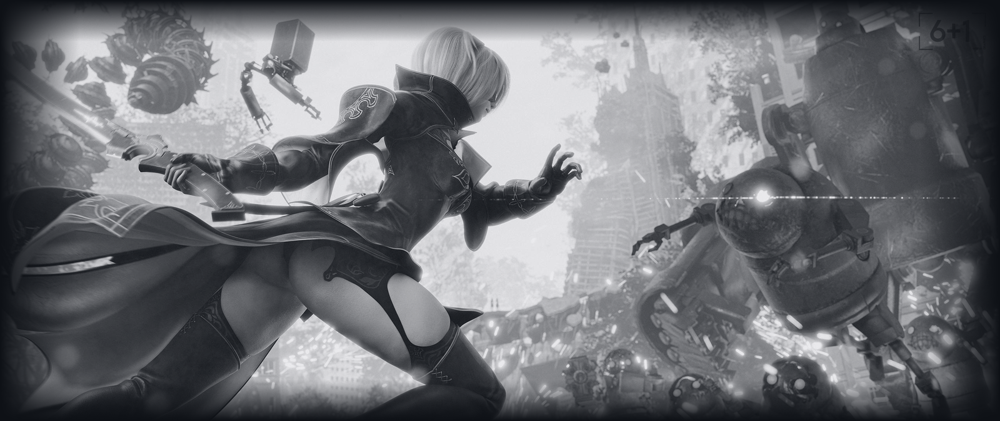

 

# Hi, I'm Daniyar 👋

### Game Developer • Unity Specialist • Interactive Systems Engineer

 

 

---

 

## 🧭 About Me

Разработчик, увлечённый созданием интерактивных миров — от игровой логики и шейдеров до окружения, которое рассказывает историю без единого слова. Работаю на стыке технологий и нарратива, уделяя особое внимание атмосфере, деталям и эмоциональному воздействию.

Среди текущих проектов — **Ancestra** и **Axiom**, где особое внимание уделяется психологическому хоррору, окружающему повествованию (environmental storytelling) и эмоциональному дизайну.

 

---

 

## 🛠️ Tech Stack

 

**Programming Languages**

  

**Game & Graphics Development**

  

**Web Development**

  

**Tools & Platforms**

